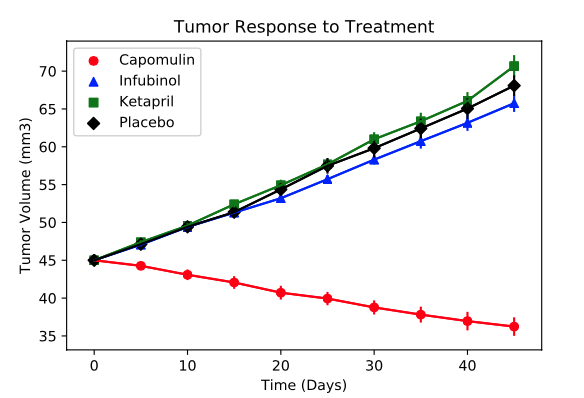
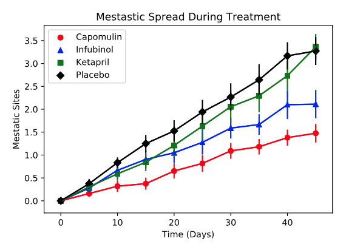
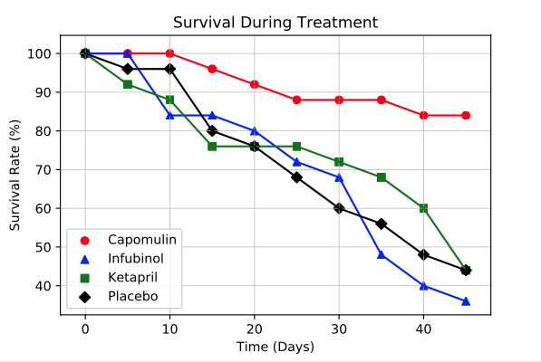
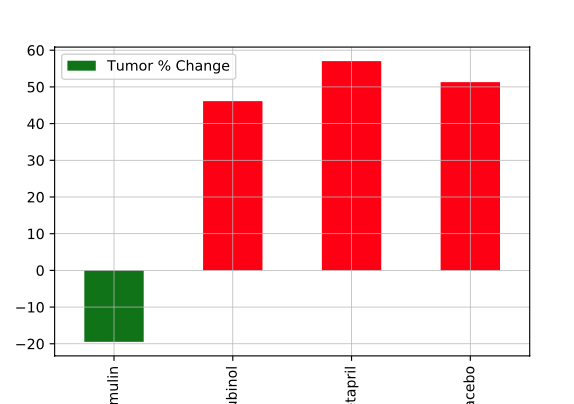

# MatplotLib Graphs for analysis of various drug therapies

## Summary
Jupyter Notebook that uses Pandas for statistical calculations and Matplotlib library to create scatter plots and bar graphs to show how four cancer treatments (Capomulin, Infubinol, Ketapril, and Placebo) compare.

## Graphs
### Figure 1. Mean Tumor Volume

### Figure 2. Metastatic Sites

### Figure 3. Mouse Survival Rates

### Figure 4. Tumor % Change

## Observations
*1 Based on the tumor volume over time data/figure, it appears that two drugs were successdful at reducing tumors, Capomulin and Ramicane

*2 Based on the mestatic site data, # of mestatic sites increased regardless of drug used

*3 Based on Mouse count, highest survival rate when using two drugs Propriva and Infubinol
